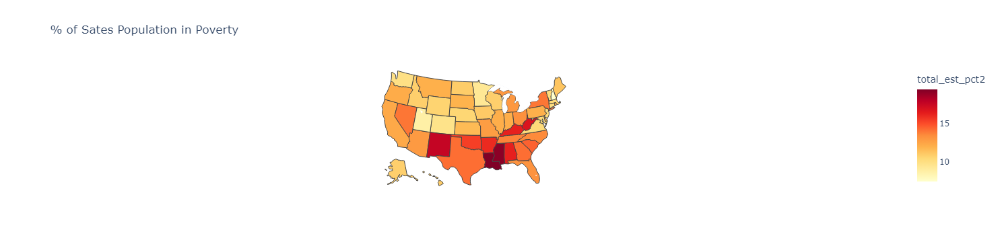
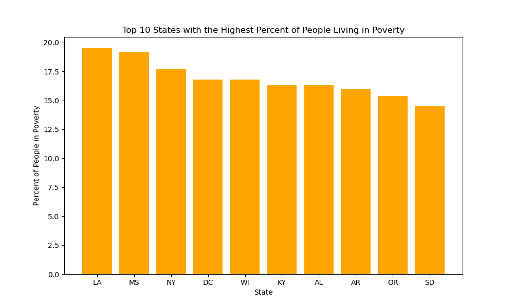
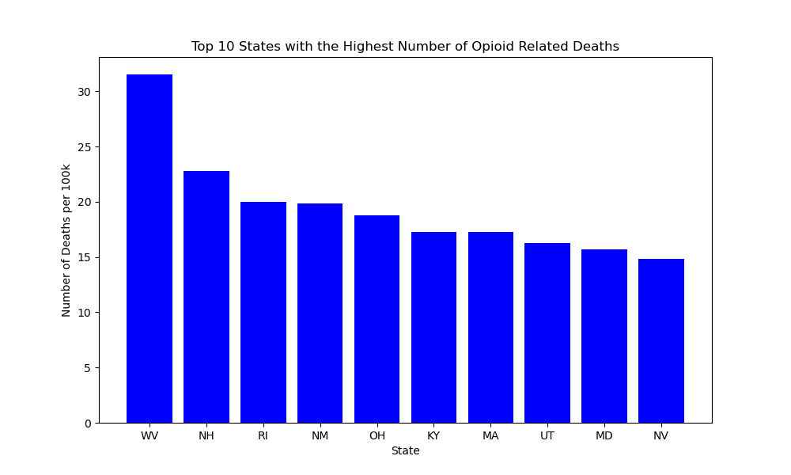
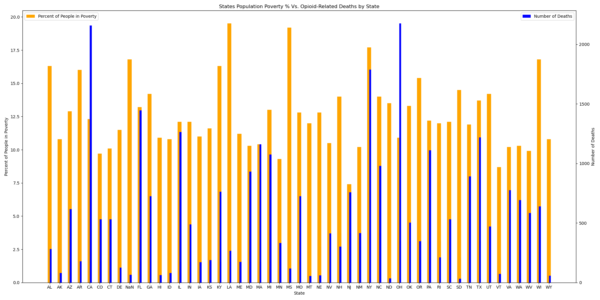

# Fentanyl_Project1

# Analysis of Poverty and Opioid-Related Deaths in the United States

## Question and Motivation

**Question:** Is there a relation between people in the United States that live in poverty and the amount of deaths related to opioids?

I find this question interesting because I believe that there is an assumption that people who live in poverty are more likely to be using and/or dying from the opioid crisis that is going on in the United States. I wanted to find out if that assumption were true.

## Data Collection and Research

To further dive into the question above, I needed to find various datasets that could help me find my answer. I first decided that I wanted to look at each state individually and find out the percent of each state's population that lived in poverty.

After finding that data, I determined that if I wanted to see if there was a relation between people in poverty and deaths related to opioids, I needed to find a second dataset that would show me the number of deaths in each state that were due to opioids.

### Data Sources

1. **Economic Research Service (USDA)**: [USDA Data](https://data.ers.usda.gov/reports.aspx?ID=17826)
2. **Demographic Data from The Home of the US Government's Open Data**: [data.gov](https://data.gov)

## Data Exploration and Clean-Up Process

Once I had my datasets, each dataset included plenty of information that was unrelated to what was important to me. I needed to make sure I was only looking at the necessary information related to my question. I broke down the first dataset to look only at the individual state itself and the percent of each state's population that lived in poverty.

### Code Example for Cleaning Poverty Data

df = df[['state_National', 'total_est_pct2']]
df = df.dropna(inplace=False)

By doing this, my dataframe will only show me what I need. The state and the percent of each state’s population that lives in poverty. I also wanted to abbreviate every state so my data would be easier to read. To do that I added an abbreviated state column to my dataframe called “Abbreviations” 

I wanted to show this information for every single state, so to do that I created a heat map from my dataframe. 

fig = px.choropleth(df,
                    locations='Abbreviation',
                    locationmode="USA-states",
                    color='total_est_pct2',
                    scope="usa",
                    color_continuous_scale="YlOrRd",  # or any other color scale
                    title=" % of Sates Population in Poverty")

fig.show()

To further show this information in a more condensed and easier to read way. I created a bar graph just showing the top 10 states with the highest poverty percentage.

df4 = pd.DataFrame(data)
top_5_states = df4.sort_values(by='total_est_pct2', ascending=False).head(10)

plt.figure(figsize=(10, 6))
plt.bar(top_5_states['Abbreviation'], top_5_states['total_est_pct2'], color='orange')
plt.xlabel('State')
plt.ylabel('Percent of People in Poverty')
plt.title('Top 10 States with the Highest Percent of People Living in Poverty')

For the second dataset I only wanted to look at each state, the total population and the number of opioid related deaths per 100k people.

df3 = df2.loc[(df2["Year"] == 2014), ["State", "Deaths", "Abbreviation"]]
df3 = pd.merge(df3, pop_by_state_df2, how="inner", on="Abbreviation")
df3 = df3[["State", "Abbreviation", "Deaths", "Population"]]
df3["Deaths"] = df3["Deaths"].astype(int)
df3["Deaths per 100k"] = df3["Deaths"].div(df3["Population"].values,axis=0)
df3["Deaths per 100k"] = df3["Deaths per 100k"].round(3)
df3.head()

I displayed this data using a Bar Chart similar to the one I just showed above.

## Analysis Process

After breaking down the datasets I was able to merge them and create a double bar chart showing my findings side by side to see if there was any relation to the original proposed question. 
I displayed the first bar chart in descending sort, with the highest poverty percentage state first and I stacked that next to the total population and the number of opioid related deaths per 100k people.

After looking at the final bar graph that included the merged data. I came to the conclusion that our expectation of people living in poverty had a higher death rate due to opioids were not true.

